# Covid_Analysis

## Phân tích dữ liệu khi đã có dữ liệu xạch sau khi lọc.
>- Function sys.patch.append() thêm vào khi ta có thư mục chứa các module riêng.
>- Dưới đây ta sử dụng chủ yếu 3 module numpy, pandas và matplotlib


```python
import sys
sys.path.append("c:/users/root/appdata/local/programs/python/python38-32/lib/site-packages")
import numpy as np
import pandas as pd
import matplotlib.pyplot as plt
from sklearn.impute import SimpleImputer
```

> -Chúng ta sẽ kiểm tra bảng dữ liệu này gồm có các trường nào.


```python
df = pd.read_csv('covid_19_data.csv')
df.head(20)
```


<div>
<table border="1" class="dataframe">
  <thead>
    <tr style="text-align: right;">
      <th></th>
      <th>SNo</th>
      <th>ObservationDate</th>
      <th>Province/State</th>
      <th>Country/Region</th>
      <th>Last Update</th>
      <th>Confirmed</th>
      <th>Deaths</th>
      <th>Recovered</th>
    </tr>
  </thead>
  <tbody>
    <tr>
      <th>0</th>
      <td>1</td>
      <td>01/22/2020</td>
      <td>Anhui</td>
      <td>Mainland China</td>
      <td>1/22/2020 17:00</td>
      <td>1.0</td>
      <td>0.0</td>
      <td>0.0</td>
    </tr>
    <tr>
      <th>1</th>
      <td>2</td>
      <td>01/22/2020</td>
      <td>Beijing</td>
      <td>Mainland China</td>
      <td>1/22/2020 17:00</td>
      <td>14.0</td>
      <td>0.0</td>
      <td>0.0</td>
    </tr>
    <tr>
      <th>2</th>
      <td>3</td>
      <td>01/22/2020</td>
      <td>Chongqing</td>
      <td>Mainland China</td>
      <td>1/22/2020 17:00</td>
      <td>6.0</td>
      <td>0.0</td>
      <td>0.0</td>
    </tr>
    <tr>
      <th>3</th>
      <td>4</td>
      <td>01/22/2020</td>
      <td>Fujian</td>
      <td>Mainland China</td>
      <td>1/22/2020 17:00</td>
      <td>1.0</td>
      <td>0.0</td>
      <td>0.0</td>
    </tr>
    <tr>
      <th>4</th>
      <td>5</td>
      <td>01/22/2020</td>
      <td>Gansu</td>
      <td>Mainland China</td>
      <td>1/22/2020 17:00</td>
      <td>0.0</td>
      <td>0.0</td>
      <td>0.0</td>
    </tr>
    <tr>
      <th>5</th>
      <td>6</td>
      <td>01/22/2020</td>
      <td>Guangdong</td>
      <td>Mainland China</td>
      <td>1/22/2020 17:00</td>
      <td>26.0</td>
      <td>0.0</td>
      <td>0.0</td>
    </tr>
    <tr>
      <th>6</th>
      <td>7</td>
      <td>01/22/2020</td>
      <td>Guangxi</td>
      <td>Mainland China</td>
      <td>1/22/2020 17:00</td>
      <td>2.0</td>
      <td>0.0</td>
      <td>0.0</td>
    </tr>
    <tr>
      <th>7</th>
      <td>8</td>
      <td>01/22/2020</td>
      <td>Guizhou</td>
      <td>Mainland China</td>
      <td>1/22/2020 17:00</td>
      <td>1.0</td>
      <td>0.0</td>
      <td>0.0</td>
    </tr>
    <tr>
      <th>8</th>
      <td>9</td>
      <td>01/22/2020</td>
      <td>Hainan</td>
      <td>Mainland China</td>
      <td>1/22/2020 17:00</td>
      <td>4.0</td>
      <td>0.0</td>
      <td>0.0</td>
    </tr>
    <tr>
      <th>9</th>
      <td>10</td>
      <td>01/22/2020</td>
      <td>Hebei</td>
      <td>Mainland China</td>
      <td>1/22/2020 17:00</td>
      <td>1.0</td>
      <td>0.0</td>
      <td>0.0</td>
    </tr>
    <tr>
      <th>10</th>
      <td>11</td>
      <td>01/22/2020</td>
      <td>Heilongjiang</td>
      <td>Mainland China</td>
      <td>1/22/2020 17:00</td>
      <td>0.0</td>
      <td>0.0</td>
      <td>0.0</td>
    </tr>
    <tr>
      <th>11</th>
      <td>12</td>
      <td>01/22/2020</td>
      <td>Henan</td>
      <td>Mainland China</td>
      <td>1/22/2020 17:00</td>
      <td>5.0</td>
      <td>0.0</td>
      <td>0.0</td>
    </tr>
    <tr>
      <th>12</th>
      <td>13</td>
      <td>01/22/2020</td>
      <td>Hong Kong</td>
      <td>Hong Kong</td>
      <td>1/22/2020 17:00</td>
      <td>0.0</td>
      <td>0.0</td>
      <td>0.0</td>
    </tr>
    <tr>
      <th>13</th>
      <td>14</td>
      <td>01/22/2020</td>
      <td>Hubei</td>
      <td>Mainland China</td>
      <td>1/22/2020 17:00</td>
      <td>444.0</td>
      <td>17.0</td>
      <td>28.0</td>
    </tr>
    <tr>
      <th>14</th>
      <td>15</td>
      <td>01/22/2020</td>
      <td>Hunan</td>
      <td>Mainland China</td>
      <td>1/22/2020 17:00</td>
      <td>4.0</td>
      <td>0.0</td>
      <td>0.0</td>
    </tr>
    <tr>
      <th>15</th>
      <td>16</td>
      <td>01/22/2020</td>
      <td>Inner Mongolia</td>
      <td>Mainland China</td>
      <td>1/22/2020 17:00</td>
      <td>0.0</td>
      <td>0.0</td>
      <td>0.0</td>
    </tr>
    <tr>
      <th>16</th>
      <td>17</td>
      <td>01/22/2020</td>
      <td>Jiangsu</td>
      <td>Mainland China</td>
      <td>1/22/2020 17:00</td>
      <td>1.0</td>
      <td>0.0</td>
      <td>0.0</td>
    </tr>
    <tr>
      <th>17</th>
      <td>18</td>
      <td>01/22/2020</td>
      <td>Jiangxi</td>
      <td>Mainland China</td>
      <td>1/22/2020 17:00</td>
      <td>2.0</td>
      <td>0.0</td>
      <td>0.0</td>
    </tr>
    <tr>
      <th>18</th>
      <td>19</td>
      <td>01/22/2020</td>
      <td>Jilin</td>
      <td>Mainland China</td>
      <td>1/22/2020 17:00</td>
      <td>0.0</td>
      <td>0.0</td>
      <td>0.0</td>
    </tr>
    <tr>
      <th>19</th>
      <td>20</td>
      <td>01/22/2020</td>
      <td>Liaoning</td>
      <td>Mainland China</td>
      <td>1/22/2020 17:00</td>
      <td>2.0</td>
      <td>0.0</td>
      <td>0.0</td>
    </tr>
  </tbody>
</table>
</div>


> +Chúng ta sẽ bỏ cột SNo và Last Update trong bảng dữ liệu, sau đó đổi tên 3 cột rồi chuyển đổi cột Date về thời gian hệ thống.

> +Trong phần này ta sử dụng hàm SimpleImputer() của sklearn để sử lý những dữ liệu thiếu sót (NaN/Null), hoạc có 1 cách khác nữa là nếu ta sử dụng DataFrame thì ta có thể sử dụng hàm fillna() của Pandas để lọc dữ liệu thiếu sót.

> +Sau đó Nhóm các dữ liệu có chung 1 Quốc gia và ngày thông báo lại với nhau, những cột có dữ liệu số sẽ được tính tổng lại theo nhóm, riêng cột Tỉnh thành sẽ không được cộng lại theo nhóm và bị loại bỏ.


```python
df.drop(['SNo','Last Update'],axis=1,inplace=True)
df.rename(columns = {'ObservationDate':'Date','Province/State':'State','Country/Region':'Country'},inplace=True)
df['Date'] = pd.to_datetime(df['Date'])
imputer = SimpleImputer(strategy='constant')
df2 = pd.DataFrame(imputer.fit_transform(df),columns=df.columns)
df3 = df2.groupby(['Country','Date'])[['Country','Date','Confirmed','Deaths','Recovered']].sum().reset_index()
df3.head(20)
```


<div>
<table border="1" class="dataframe">
  <thead>
    <tr style="text-align: right;">
      <th></th>
      <th>Country</th>
      <th>Date</th>
      <th>Confirmed</th>
      <th>Deaths</th>
      <th>Recovered</th>
    </tr>
  </thead>
  <tbody>
    <tr>
      <th>0</th>
      <td>Azerbaijan</td>
      <td>2020-02-28</td>
      <td>1.0</td>
      <td>0.0</td>
      <td>0.0</td>
    </tr>
    <tr>
      <th>1</th>
      <td>('St. Martin',)</td>
      <td>2020-03-10</td>
      <td>2.0</td>
      <td>0.0</td>
      <td>0.0</td>
    </tr>
    <tr>
      <th>2</th>
      <td>Afghanistan</td>
      <td>2020-02-24</td>
      <td>1.0</td>
      <td>0.0</td>
      <td>0.0</td>
    </tr>
    <tr>
      <th>3</th>
      <td>Afghanistan</td>
      <td>2020-02-25</td>
      <td>1.0</td>
      <td>0.0</td>
      <td>0.0</td>
    </tr>
    <tr>
      <th>4</th>
      <td>Afghanistan</td>
      <td>2020-02-26</td>
      <td>1.0</td>
      <td>0.0</td>
      <td>0.0</td>
    </tr>
    <tr>
      <th>5</th>
      <td>Afghanistan</td>
      <td>2020-02-27</td>
      <td>1.0</td>
      <td>0.0</td>
      <td>0.0</td>
    </tr>
    <tr>
      <th>6</th>
      <td>Afghanistan</td>
      <td>2020-02-28</td>
      <td>1.0</td>
      <td>0.0</td>
      <td>0.0</td>
    </tr>
    <tr>
      <th>7</th>
      <td>Afghanistan</td>
      <td>2020-02-29</td>
      <td>1.0</td>
      <td>0.0</td>
      <td>0.0</td>
    </tr>
    <tr>
      <th>8</th>
      <td>Afghanistan</td>
      <td>2020-03-01</td>
      <td>1.0</td>
      <td>0.0</td>
      <td>0.0</td>
    </tr>
    <tr>
      <th>9</th>
      <td>Afghanistan</td>
      <td>2020-03-02</td>
      <td>1.0</td>
      <td>0.0</td>
      <td>0.0</td>
    </tr>
    <tr>
      <th>10</th>
      <td>Afghanistan</td>
      <td>2020-03-03</td>
      <td>2.0</td>
      <td>0.0</td>
      <td>0.0</td>
    </tr>
    <tr>
      <th>11</th>
      <td>Afghanistan</td>
      <td>2020-03-04</td>
      <td>4.0</td>
      <td>0.0</td>
      <td>0.0</td>
    </tr>
    <tr>
      <th>12</th>
      <td>Afghanistan</td>
      <td>2020-03-05</td>
      <td>4.0</td>
      <td>0.0</td>
      <td>0.0</td>
    </tr>
    <tr>
      <th>13</th>
      <td>Afghanistan</td>
      <td>2020-03-06</td>
      <td>4.0</td>
      <td>0.0</td>
      <td>0.0</td>
    </tr>
    <tr>
      <th>14</th>
      <td>Afghanistan</td>
      <td>2020-03-07</td>
      <td>4.0</td>
      <td>0.0</td>
      <td>0.0</td>
    </tr>
    <tr>
      <th>15</th>
      <td>Afghanistan</td>
      <td>2020-03-08</td>
      <td>5.0</td>
      <td>0.0</td>
      <td>0.0</td>
    </tr>
    <tr>
      <th>16</th>
      <td>Afghanistan</td>
      <td>2020-03-09</td>
      <td>7.0</td>
      <td>0.0</td>
      <td>0.0</td>
    </tr>
    <tr>
      <th>17</th>
      <td>Afghanistan</td>
      <td>2020-03-10</td>
      <td>8.0</td>
      <td>0.0</td>
      <td>0.0</td>
    </tr>
    <tr>
      <th>18</th>
      <td>Afghanistan</td>
      <td>2020-03-11</td>
      <td>11.0</td>
      <td>0.0</td>
      <td>0.0</td>
    </tr>
    <tr>
      <th>19</th>
      <td>Afghanistan</td>
      <td>2020-03-12</td>
      <td>12.0</td>
      <td>0.0</td>
      <td>0.0</td>
    </tr>
  </tbody>
</table>
</div>


> Hàm unique() giúp ta lọc ra list những quốc gia có trong bảng dữ liệu và đặc biệt tên quốc gia trong list này sẽ không bị chùng lập với nhau.


```python
countries = df3['Country'].unique()
len(countries)
```


    226


>- Dòng lệnh dưới sẽ giúp ta vẽ biểu đồ số ca (xác nhận, chữa khỏi, chết) trải qua theo từng ngày. Chúng ta có thể chạy biểu đồ hết 226 quốc gia, nhưng như vậy thì hơi dài nên ta lấy mẫu 15 quốc gia (range  0->15).
>- Ta thấy 2 quốc gia đầu tiên(Azerbaijan, ST. Martin) có số ngày là số thập phân là vì những quốc gia này không được cập nhật dữ liệu thường xuyên theo dõi những trường hợp Covid, chính xác hơn thì nó mới chỉ khi nhận trong 1 ngày hoạc là trường hợp thu thập dữ liệu này nó bị lỗi.
>- Dưới những đồ thị ta biết được rẵng những quốc gia nào có đường màu xanh nước biển tách rời(không đi sát nhau) đường màu xanh lá cây thì rõ ràng 1 điều là những quốc gia đó khắc phục, chữa trị Covid chưa tốt(có thể là do cơ sở vật chất, y tế các quốc gia đó không tốt). Với các quốc gia có đường nét đứt màu xanh lá cây thì ta biết là quốc gia đó chữa chị bệnh khá lâu nên mới không có cập nhật dữ liệu bình phục thường xuyên.
>- Những đường xanh nước biển càng dốc cho thấy là quốc gia đó đang trong giai đoạn bùng phát mạnh, nhưng nếu 2 đường màu xanh đi sát nhau và tách xa đường màu đỏ thì quốc gia đó mạnh trong việc ngăn ngừa bùng phát và quốc gia đó cũng đáng an tâm.


```python
#range(0,len(countries))
for idx in range(0,15):
    C = df3[df3['Country']==countries[idx]].reset_index()
    plt.scatter(np.arange(0,len(C)),C['Confirmed'],color='blue',label='Confirmed')
    plt.scatter(np.arange(0,len(C)),C['Recovered'],color='green',label='Recovered')
    plt.scatter(np.arange(0,len(C)),C['Deaths'],color='red',label='Deaths')
    plt.title(countries[idx])
    plt.xlabel('Days since the first suspect')
    plt.ylabel('Number of cases')
    plt.legend()
    plt.show()
```


    
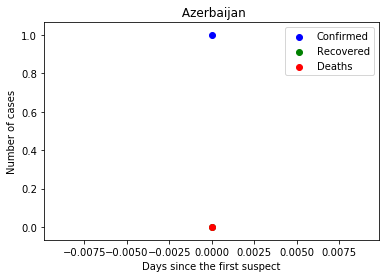
    


    
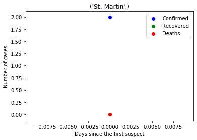
    


    
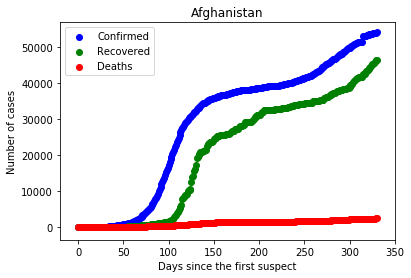
    


    
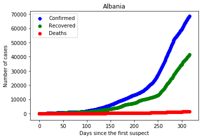
    


    
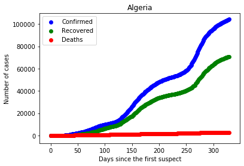
    


    
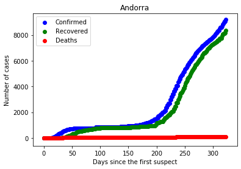
    


    
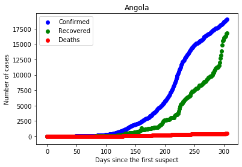
    


    
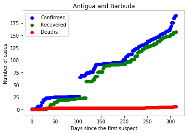
    


    
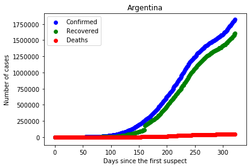
    


    
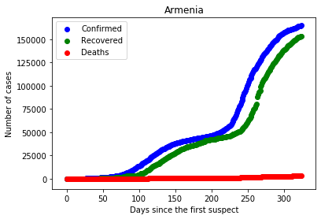
    


    
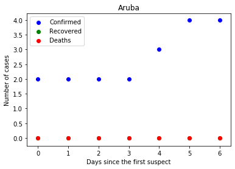
    


    
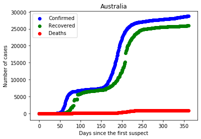
    


    
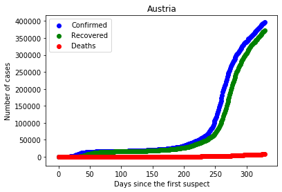
    


    
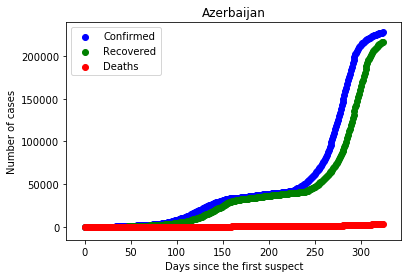
    


    
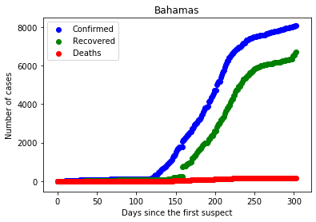
    


>- Chúng ta có thể xem trực tiếp của quốc gia Mỹ và Việt Nam xem và so sánh nó như thế nào.


```python
#Graph of US
C = df3[df3['Country']=='US'].reset_index()
plt.scatter(np.arange(0,len(C)),C['Confirmed'],color='blue',label='Confirmed')
plt.scatter(np.arange(0,len(C)),C['Recovered'],color='green',label='Recovered')
plt.scatter(np.arange(0,len(C)),C['Deaths'],color='red',label='Deaths')
plt.title('US')
plt.xlabel('Days since the first suspect')
plt.ylabel('Number of cases')
plt.legend()
plt.ticklabel_format(useOffset=False, style='plain')
plt.show()
#Graph of Vietnam
C = df3[df3['Country']=='Vietnam'].reset_index()
plt.scatter(np.arange(0,len(C)),C['Confirmed'],color='blue',label='Confirmed')
plt.scatter(np.arange(0,len(C)),C['Recovered'],color='green',label='Recovered')
plt.scatter(np.arange(0,len(C)),C['Deaths'],color='red',label='Deaths')
plt.title('Vietnam')
plt.xlabel('Days since the first suspect')
plt.ylabel('Number of cases')
plt.legend()
plt.show()
```


    
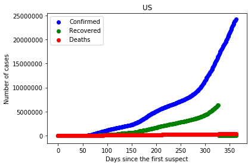
    


    
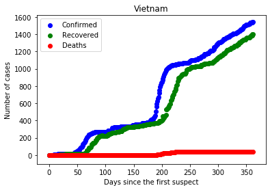
    


>- Ta sẽ xem biểu đồ các trường hợp theo ngày của cả thế giới hiện nay sẽ như thế nào


```python
df4 = df3.groupby(['Date'])[['Date','Confirmed','Deaths','Recovered']].sum().reset_index()
C = df4
print(C)
plt.scatter(np.arange(0,len(C)),C['Confirmed'],color='blue',label='Confirmed')
plt.scatter(np.arange(0,len(C)),C['Recovered'],color='green',label='Recovered')
plt.scatter(np.arange(0,len(C)),C['Deaths'],color='red',label='Deaths')
plt.title('World')
plt.xlabel('Days since the first suspect')
plt.ylabel('Number of cases')
plt.legend()
plt.ticklabel_format(useOffset=False, style='plain') # unlimit number of axist ex: 1e8
plt.show()
```

              Date   Confirmed     Deaths   Recovered
    0   2020-01-22       557.0       17.0        30.0
    1   2020-01-23      1097.0       34.0        60.0
    2   2020-01-24       941.0       26.0        39.0
    3   2020-01-25      1437.0       42.0        42.0
    4   2020-01-26      2118.0       56.0        56.0
    ..         ...         ...        ...         ...
    359 2021-01-15  93876206.0  2009092.0  51685853.0
    360 2021-01-16  94495403.0  2022125.0  52005821.0
    361 2021-01-17  95045634.0  2030831.0  52318440.0
    362 2021-01-18  95559647.0  2040107.0  52634885.0
    363 2021-01-19  96158735.0  2056996.0  53035240.0
    
    [364 rows x 4 columns]
    


    
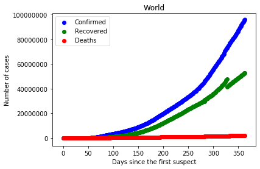
    


